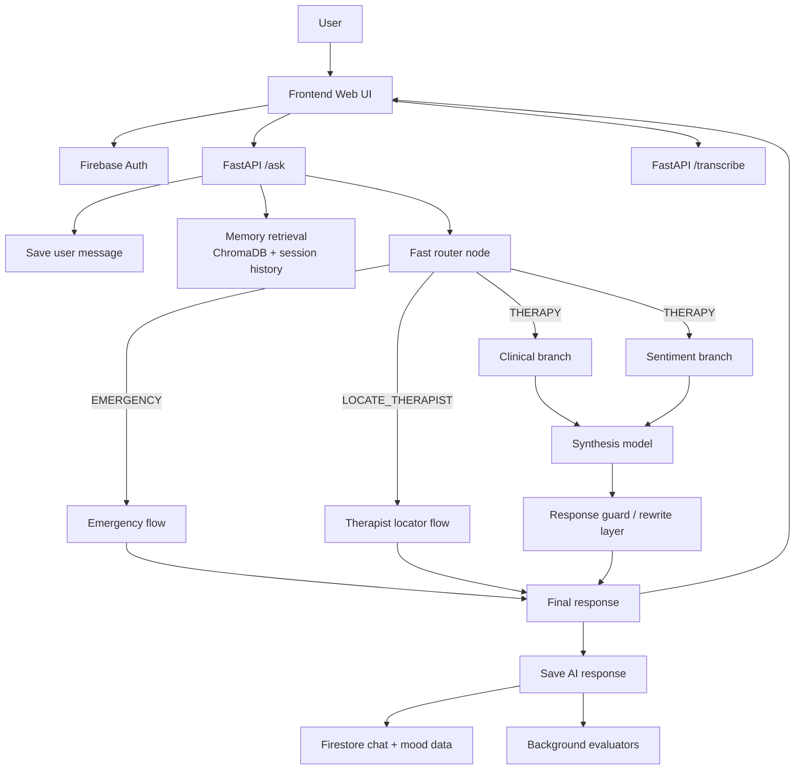
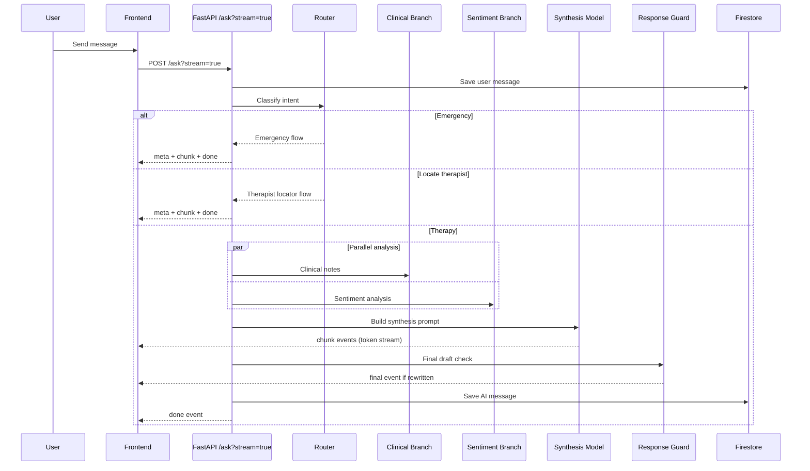
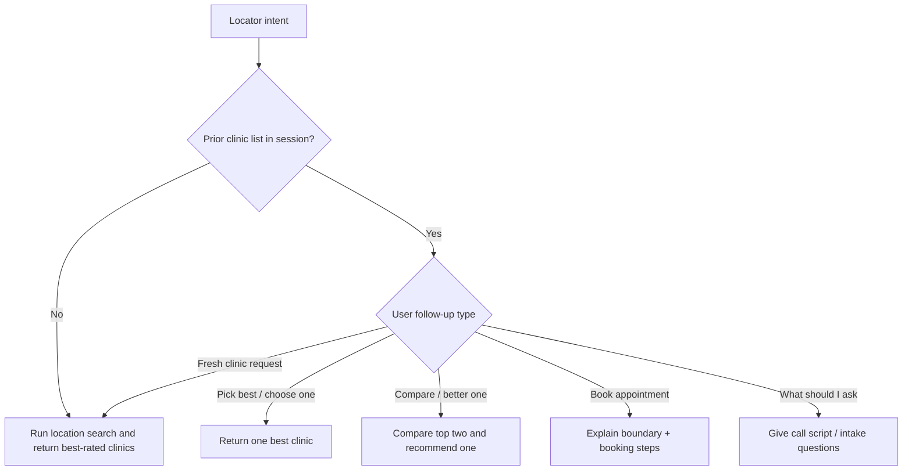

# Trisoul AI

Trisoul AI is an academic prototype for empathetic mental-health chat support. It combines a FastAPI backend, a parallel LangGraph StateGraph workflow, Firebase chat storage, ChromaDB memory retrieval, and a browser frontend.

The project includes benchmark-facing endpoints for automated evaluation and a therapist-style export endpoint for reviewing benchmark patient conversations.

## Overview

Trisoul AI is an empathetic AI companion designed to support mental-health reflection, emotional check-ins, and guided self-expression. Users can chat with Trisoul about stress, anxiety, loneliness, low mood, relationship concerns, or daily emotional challenges.

The system stores user-specific chat sessions, retrieves relevant past context, tracks mood trends, and provides dashboard-style insights over time. It is built as an academic prototype for evaluating AI-assisted supportive conversation, safety behavior, user satisfaction proxies, and clinical/HCI response quality.

Trisoul is not a licensed therapist or medical system. It does not diagnose, prescribe, or replace professional care.

## What Trisoul Does

- Provides empathetic chat responses for emotional support
- Maintains separate chat histories for each user and session
- Retrieves relevant past memories to personalize responses
- Tracks mood scores and emotional themes over time
- Displays session and global mood analytics in the UI
- Supports benchmark users for academic evaluation
- Exposes therapist-style benchmark exports for reviewing simulated patient conversations
- Includes safety routing for crisis-like messages and therapist-location requests

## Features

- Empathetic conversational support
- Parallel LangGraph StateGraph agent workflow
- Clinical and sentiment branches executed concurrently
- User and session-scoped chat history
- Firebase-backed chat and mood storage
- ChromaDB semantic memory retrieval
- Benchmark API for simulated patients
- Shared-password benchmark UI login
- Therapist benchmark chat export
- Session mood and global analytics views
- Optional emergency, therapist-location, voice, image, and document workflows

## Updated Architecture

Trisoul now uses a parallel LangGraph `StateGraph` for therapy reasoning and a streamed `/ask` response path so the UI can render text progressively instead of waiting for one final JSON reply.

### High-Level System Diagram



### Streamed `/ask` Flow



### Therapist Locator Decision Diagram



The main latency improvement now comes from two places:

- `clinical` and `sentiment` run in parallel instead of sequentially
- the frontend receives streamed text chunks while synthesis is still generating

That means total model time still matters, but perceived latency is much lower because the user sees the answer begin almost immediately.

## Project Structure

```text
backend/
  main.py                    FastAPI routes and API orchestration
  ai_agent.py                LangGraph agent workflow
  firebase_db.py             Firebase chat, session, and mood persistence
  memory.py                  ChromaDB semantic memory
  tools.py                   Clinical, Twilio, and helper tools
  run_trisoul_evaluation.py  Live evaluation runner, outputs ignored by git
frontend/
  index.html                 Browser UI
  script.js                  Chat, dashboards, and session behavior
  auth.js                    Firebase auth and benchmark login
  style.css                  UI styling
.env.example                 Environment variable template
pyproject.toml               Python dependency metadata
```

## Requirements

- Python 3.11+
- Firebase Admin credentials
- Groq API key
- OpenAI API key
- Google Maps API key if therapist-location lookup is used
- Twilio credentials if emergency call tooling is used

## Environment Setup

Create a local `.env` file:

```bash
cp .env.example .env
```

Fill in the required values:

```env
TWILLIO_ACCOUNT_KK=your_twillio_kk_here
TWILIO_AUTH_TOKEN=your_twilio_token_here
TWILIO_FROM_NUMBER=your_twilio_number_here
EMERGENCY_CONTACT=your_emergency_contact_here
GROQ_API_KEY=your_groq_key_here
GOOGLE_MAPS_API_KEY=your_google_maps_key_here
OPENAI_API_KEY=your_openai_key_here
TESTBENCH_PASSWORD=trisoul-bench
```

Firebase Admin expects credentials at:

```text
backend/firebase_credentials.json
```

Do not commit `.env` or Firebase credentials.

## Run Backend

```bash
.venv/bin/python -m uvicorn backend.main:app --host 127.0.0.1 --port 8000
```

Backend URL:

```text
http://127.0.0.1:8000
```

FastAPI docs:

```text
http://127.0.0.1:8000/docs
```

## Run Frontend

```bash
cd frontend
../.venv/bin/python -m http.server 5500 --bind 127.0.0.1
```

Frontend URL:

```text
http://127.0.0.1:5500/
```

## Benchmark API

### Send Benchmark Chat Message

```http
POST /testbench/ask
```

Example:

```json
{
  "message": "I am feeling overwhelmed with exams.",
  "user_id": "bench_user_001",
  "session_id": "benchmark_session_1"
}
```

Example response:

```json
{
  "response": "AI response text...",
  "tool_called": "ask_mental_state_specialist",
  "user_id": "bench_user_001",
  "session_id": "benchmark_session_1"
}
```

### Benchmark UI Login

```http
POST /testbench/login
```

Example:

```json
{
  "user_id": "bench_user_001",
  "password": "trisoul-bench"
}
```

Benchmark user IDs may contain letters, numbers, underscore, dash, dot, or colon.

## Therapist Benchmark Export

```http
POST /testbench/therapist/chats
```

Example:

```json
{
  "password": "trisoul-bench",
  "user_id_prefix": "bench_",
  "include_empty": false
}
```

This returns benchmark patients, session identifiers, and full chat messages grouped by user.

## User-Scoped Read Endpoints

```http
GET /sessions/{user_id}
GET /users/{user_id}/sessions/{session_id}/messages
GET /users/{user_id}/sessions/{session_id}/mood
```

These endpoints keep benchmark users isolated even if multiple users reuse similar session IDs.

## Live Evaluation

The repo includes a lightweight live evaluation runner:

```bash
.venv/bin/python backend/run_trisoul_evaluation.py \
  --base-url http://127.0.0.1:8000 \
  --output-dir evaluation_outputs
```

Generated metric JSON files are written to `evaluation_outputs/`, which is ignored by git. Run this only when API quotas are available.

## Safety Notice

Trisoul AI is an academic prototype. It is not a licensed clinician, does not provide diagnosis or treatment, and is not a replacement for emergency services or professional care.

## Files Not To Commit

The following are intentionally ignored:

```text
.env
.venv/
backend/firebase_credentials.json
chroma_db/
evaluation_outputs/
*.db
*.log
*.pid
```
